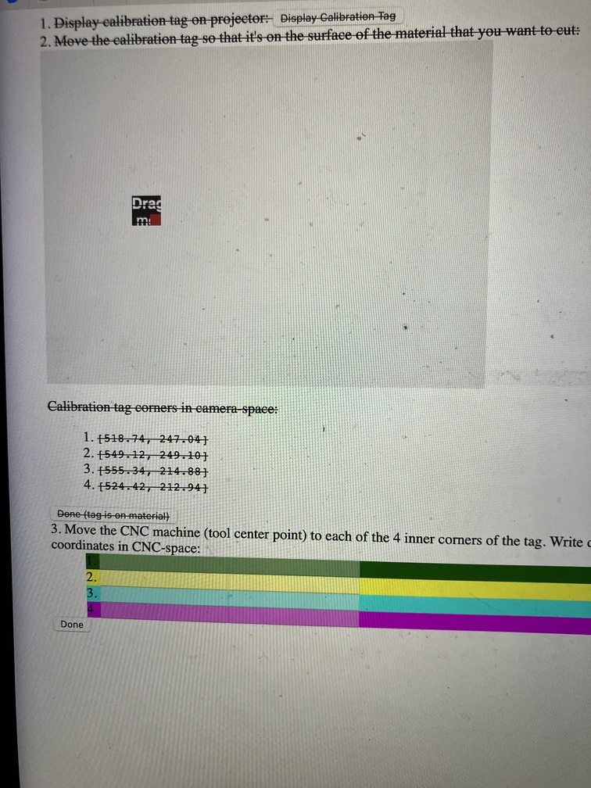
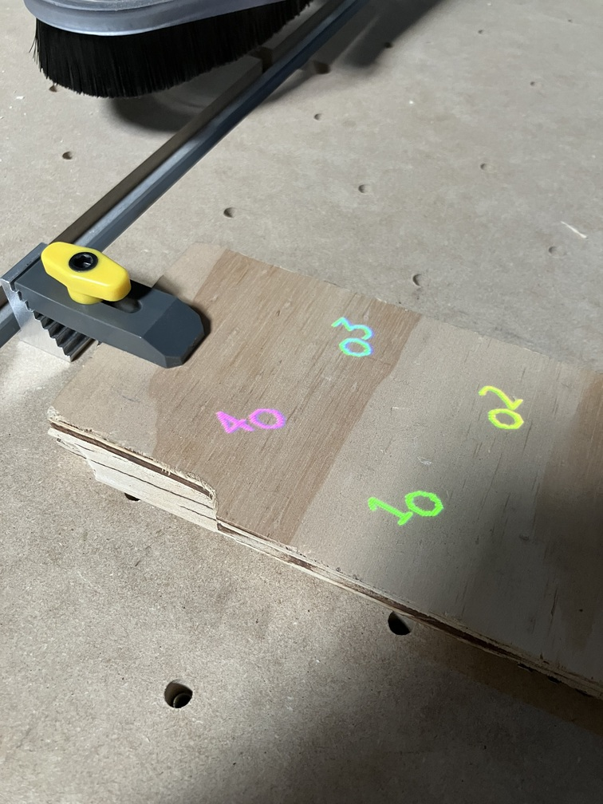
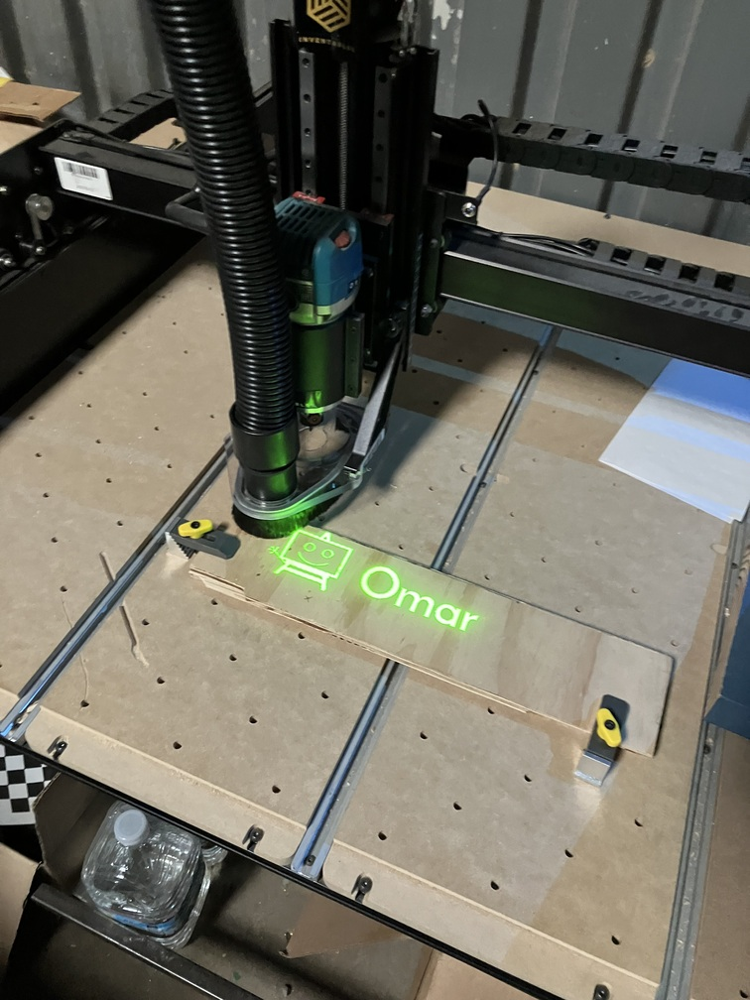
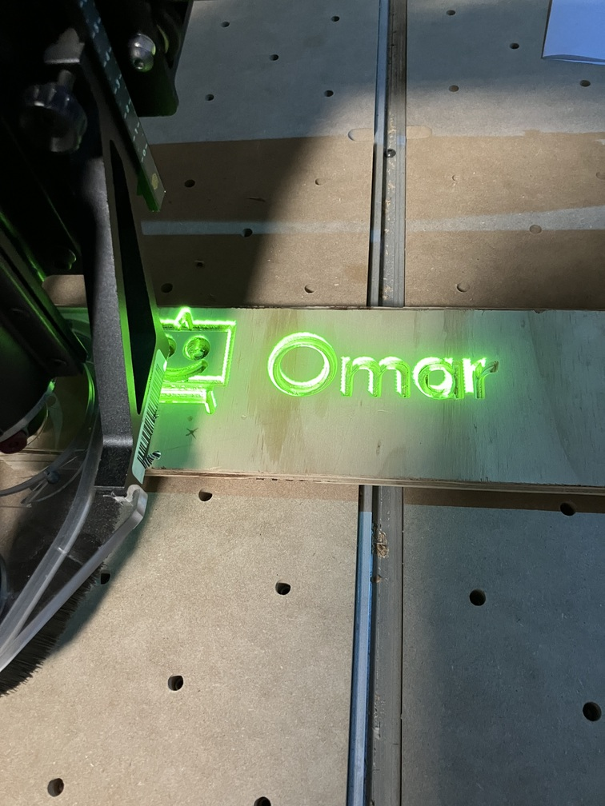

# folk-cnc

Projector preview on CNC machine bed. Built on top of
[Folk](https://folk.computer).

(This was last tested on Folk
[ca64310a0d6ccdba181dbede469f2f7fe978bedd](https://github.com/FolkComputer/folk/commit/ca64310a0d6ccdba181dbede469f2f7fe978bedd)
on September 23, 2024.)

Calibrate your CNC machine + projector + material surface, upload a
gcode file, and folk-cnc will display a preview of where your CNC
machine will cut.

Calibrating:

 

Before cut (notice the preview projection on the uncut wood) -> after
cut (see how the projection was [roughly] aligned with the cut)

 

(Accuracy depends on how well you calibrate for now, and you have to
recalibrate for each material/session -- we want to improve this
process over time so we can reuse more and more calibration
information.)

TODO: use 3d calibration, make gcode driver so you can have Folk
plugged into the machine

## Usage

1. [Set up a Folk system.](https://git.folk.computer/folk/about/)

2. Clone this repo into a `folk-cnc` subfolder in the writable
   partition FOLK-LIVE of the USB stick (if you are using a USB
   stick), or into `~/folk-live/folk-cnc` (if you are using your own
   Linux; you may need to create `~/folk-live` first).

3. Start up Folk. Go to <http://folk-WHATEVER.local:4273/cnc/> and follow the
   instructions.

## License

Apache 2.0

## Credits

[Owen Trueblood](https://owentrueblood.com) wrote [a Web-based
prototype](https://github.com/jmpinit/projected-toolpath-preview) as
part of the original project; folk-cnc inherits Owen's high-level
approach (but using an AprilTag instead of checkerboard) and the gcode
parser that he implemented.

Supported by [Gradient Retreat](https://www.gradientretreat.com).
